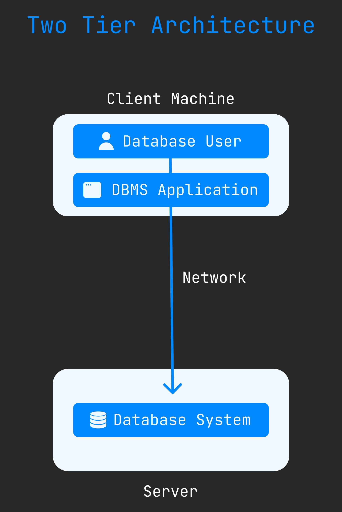
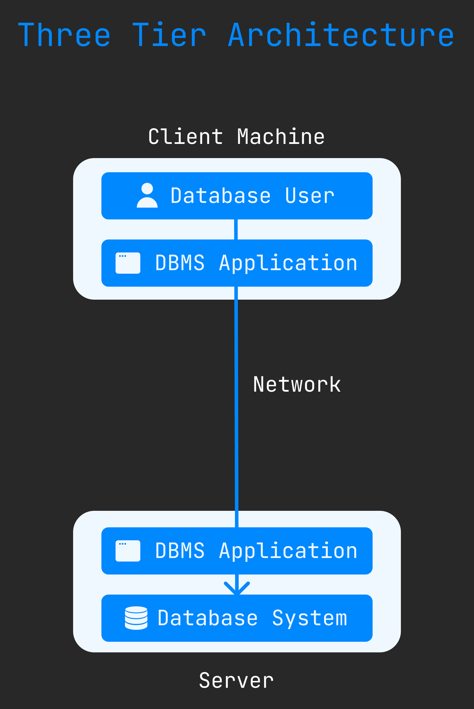

DBMS Architecture
===================
DBMS architecture help us understand the components of database system and the relation among them. The architecture of DBMS depends on the computer system on which it runs. Here three type of DBMS Architecture : 

1. *[Single Tier Architecture](#single-tier-architecture)*
2. *[Two Tier Architecture](#two-tier-architecture)*
3. *[Three Tier Architecture](#three-tier-architecture)*

## Single Tier Architecture
This type of architecture, datbase is available on the client machine, dose not need to internet connect for request for data. In that case, we can easly read and write data.

## Two Tier Architecture
This type of architecture, database present on server and DBMS application install on client machine. In that case network connect client machine to server. Here diagram : 

## Three Tier Architecture
In three tier architecture, server machine has a another DBMS application. Which is connect with Database. Here diagram : 

 

[< DBMS & RDBMS](./03.dbms_and_rdbms.md) | [Basics](./basics.md) | [DBMS Three Level Architecture >](./05.dbms_three_level_architecture.md)
------------------------------------