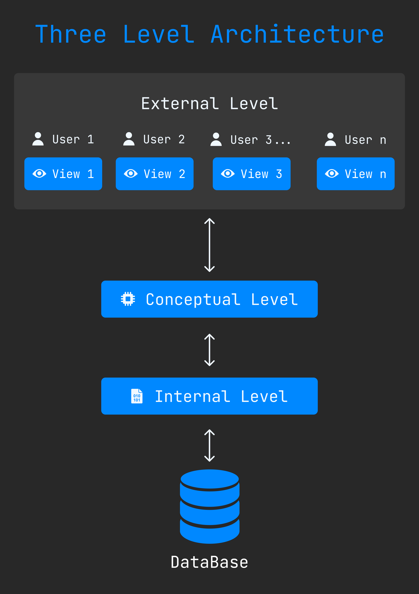

DBMS - Three Level Architecture 
================================

We can divide the DBMS in three levels. This architecture level is :

+ **[External Level (View Level)](#external-level)**
+ **[Conceptual Level (Logical Level)](#conceptual-level)**
+ **[Internal Level (Physical level)](#internal-level)**

Here three level architecture diagram. 

## External Level
External Level another name is **view level.** Also it is **Top Level**. In here user see the data which is come from database by conceptual and internal level. User dose not need to know the database schema details such as data structure, table definition etc. 

## Conceptual Level
It is called logical level too. This level described design of the database, schema of data, and such as relationship among data. This level is maintained by **DBA (Database administrator)**

## Internal Level
This is physical and lowest level of the architecture. Here describes how the data is actually stored in the storage devices. 

 

[< DBMS Architecture](./04.dbms_architecture.md) | [Basics](./basics.md) | [Data Abstraction >](./06.data_abstraction.md)
------------------------------------------------