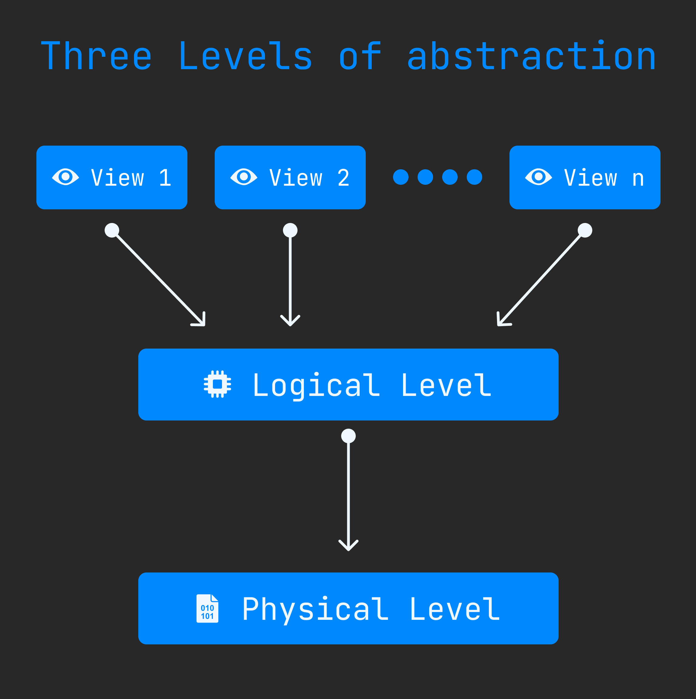

Data Abstraction in DBMS
========================
DBMS implemant with complex data structure and logic which is user can not understand easily. Also understanding the how DBMS process the data is more complex so developers hide this thing from user. It called **Data Abstraction.**. There are three levels of abstraction. Here : 

1. **[View Level](#view-level)**
2. **[Logical Level](#logical-level)**
3. **[Physical Level](#physical-level)**

## View Level
Highest level of abstartion it is. This level interaction with user. Here user interact with system with the helpy of GUI interface.

## Logical Level
This level describes what type of data stored in database.

## Physical Level
Lowest level of data abstraction. Here describe how data is actually stored in database and how to process the data in database.Here use complex data structure which is user can not understand easily.

 

[< DBMS Three Level Architecture](./05.dbms_three_level_architecture.md) | [Basics](./basics.md) | [Instance & Schema >](./07.instance_and_schema.md)
---------------------------------