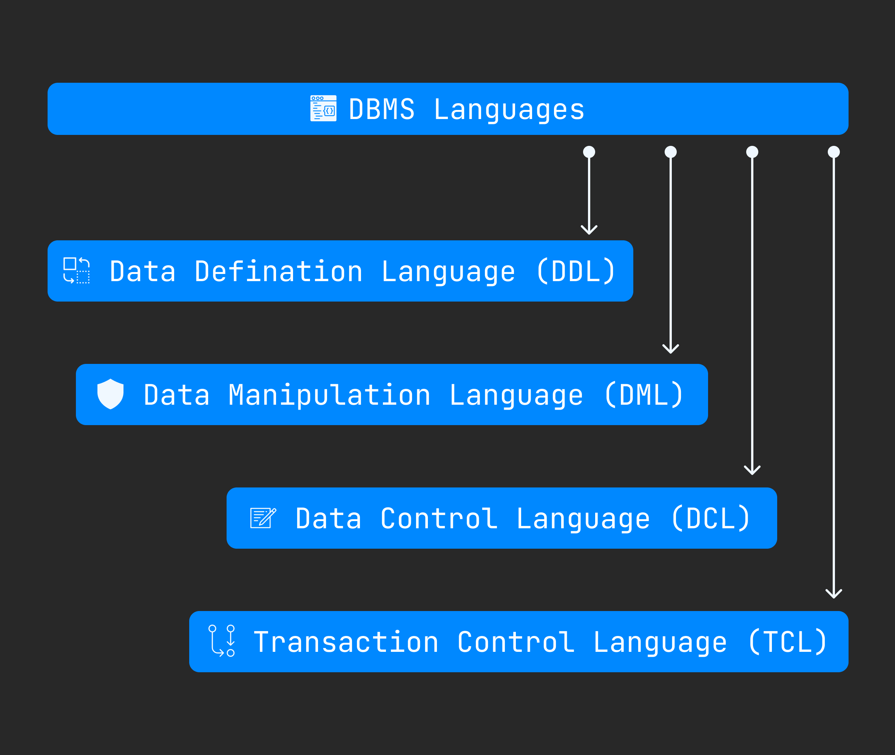

DBMS Languages
===============
DBMS languages used for read, update and store data in a database. There are so many languages that can be used for this. The mostly used **SQL(Structured Query Language)**. Commonly 4 type of DBMS languages used. Here : 

1. **[Data Definition Language (DDL)](#data-definition-language-ddl)**
2. **[Data Manipulation Language (DML)](#data-manipulation-language-dml)**
3. **[Data Control Language (DCL)](#data-control-language-dcl)**
4. **[Transaction Control Language (TCL)](#transaction-control-languagetcl)**

## Data Definition Language (DDL)
This language used for creating tables, schema, indexes, constraits etc. Here operations what we can perform on database using DDL : 

- CREATE - to create the database instance.
- ALTER - to alter structure of database.
- DROP - to drop database instances.
- TRUNCATE - to delete tables in a databse instance.
- RENAME - to rename databse instances.
- DROP - to drop objects from databse such as tables.
- Comment - to comment.

## Data Manipulation Language (DML)
This language used for accessing and updating data in a databse. Here all operation which is do with DML : 

- SELECT - to read records from table(s).
- INSERT - to insert record(s) into the table(s).
- UPDATE - update the data in table.
- DELETE - delete all the records from the table.

## Data Control Language (DCL)
This language used for granting and revoking user access on a database - 

- GRANT - to grant access to user.
- REVOKE - to revoke access from user.

## Transaction Control Language(TCL)
If we can back the previous database stage or remember current databse stage then use **TCL** language. Here the operation perform with **TCL** : 

- COMMIT - to persist the changes made by DML commands in database.
- ROLLBACK - to rollback the changes made to the databse.

 

[< Instance & Schema](./07.instance_and_schema.md) | [Basics](./basics.md) | [Data Models >](./../01.data_models/data_models.md)
--------------------------------------------