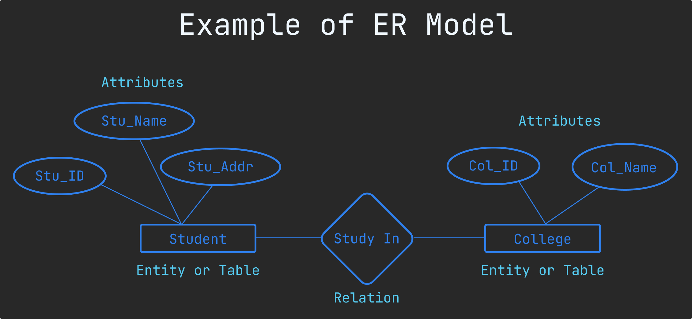
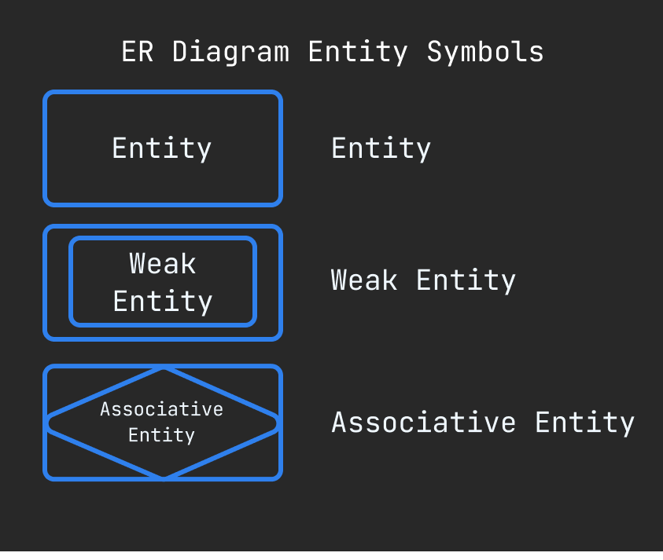
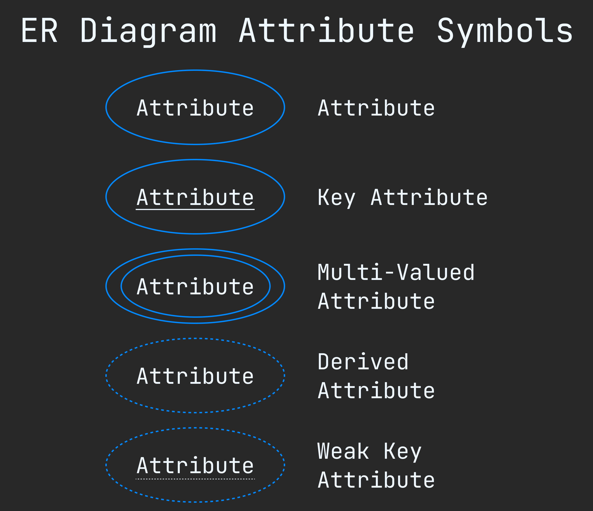
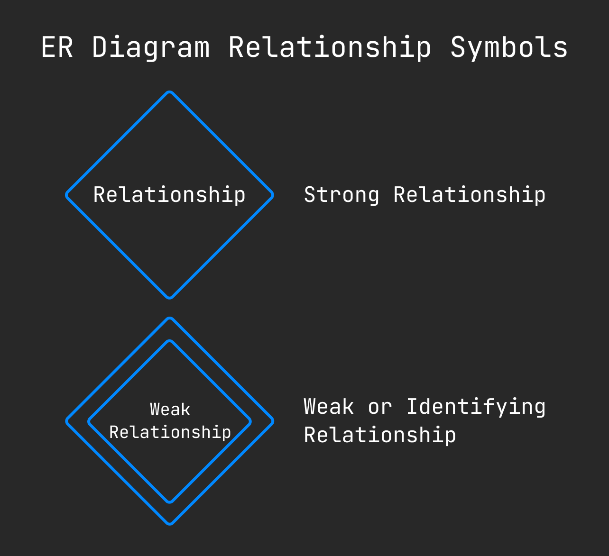
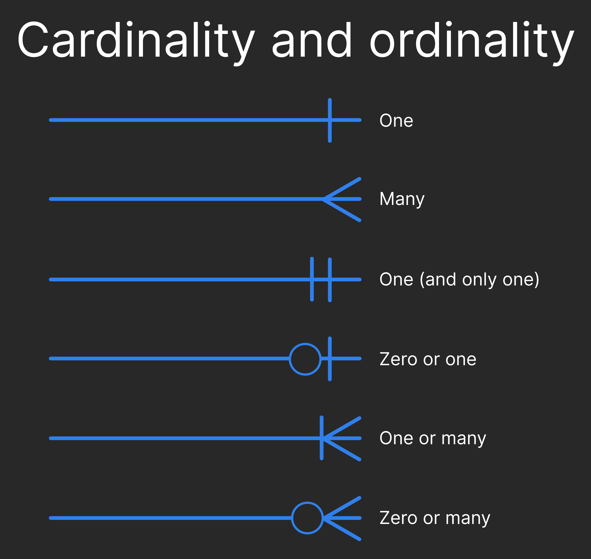

ER Model
=========

An **Entity-Relationship model (ER model)** describes the structure of a database with the help of a diagram, which is known as entity relationship diagram (ER diagram).

> 🟢 An ER diagram shows the relationship among entity sets. An entity set is a group of similar entities and these entities can have attribute.

> 🟢 In terms of DBMS, an entity is a table or attribute of a table in database, so by showing relationship among tables and their attributes.

Here is example of ER model : 

## ER diagram Symbols : 

Entity Symbols : 

Attributes Symbols :

ER diagram relationship symbols : 

Cardinality and ordinality :

> 🟢 Cardinality refers to the maximum number of times an instance in one entity can relate to instance of another entity.

> 🟢 Ordinality is the minimum number of times an instance in one entity can be associated with an instance in the related entity.

### Something basic note on symbols : 

- **Rectangle :** Represents entity sets.
- **Ellipses :** Attributes.
- **Diamons :** Relationship set.
- **Line :** They link attributes to entity sets and entity sets to relationship set.
- **Double Ellipses :** Multivalues Attributes.
- **Dashed Ellipses :** Derived Attributes.
- **Double Rectangle :** Weak Entity Sets.
- **Double Lines :** Total participation of an entity in a relationship. set.

 

### [< Data Models](./01.data_models.md)
### [Data Models](./data_models.md)
### [ER diagram design issues >](./03.er_diagram_design_issues.md)

### [Go back README](./../README.md)
--------------------------------------------
