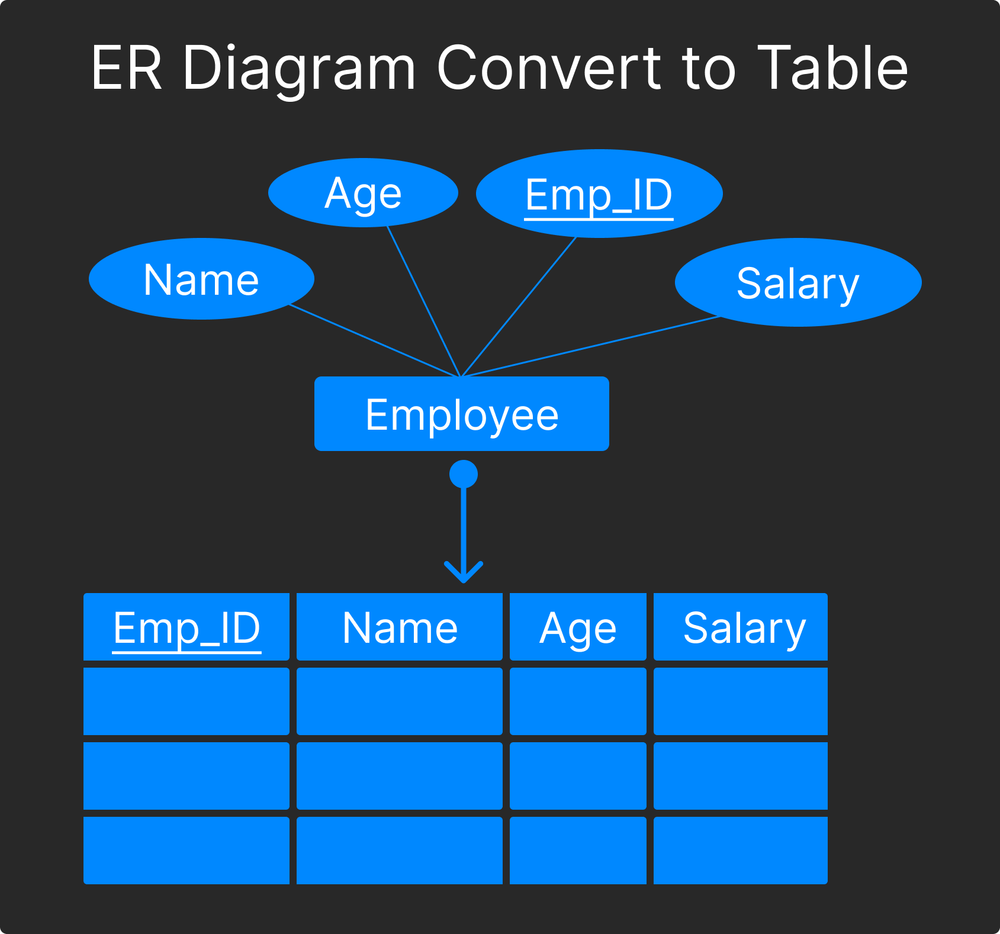

DBMS - ER Diagram to Table Conversion
======================================

### example of convert strong entity set with simple attributes.

### Example of Strong entity set with composite attributes

### Example of conver table from strong entity set with multi valued attributes

### Example of relationship set to tableconversion

 

[< Instance & Schema](./07.instance_and_schema.md) | [Basics](./basics.md) | [Data Models >](./../01.data_models/data_models.md)
--------------------------------------------

 

### [< ER Diagram Design Issues](./03.er_diagram_design_issues.md)
### [Data Models](./data_models.md)
### [DBMS Generalization >](./05.dbms_generalization.md)

### [Go back README](./../README.md)
--------------------------------------------