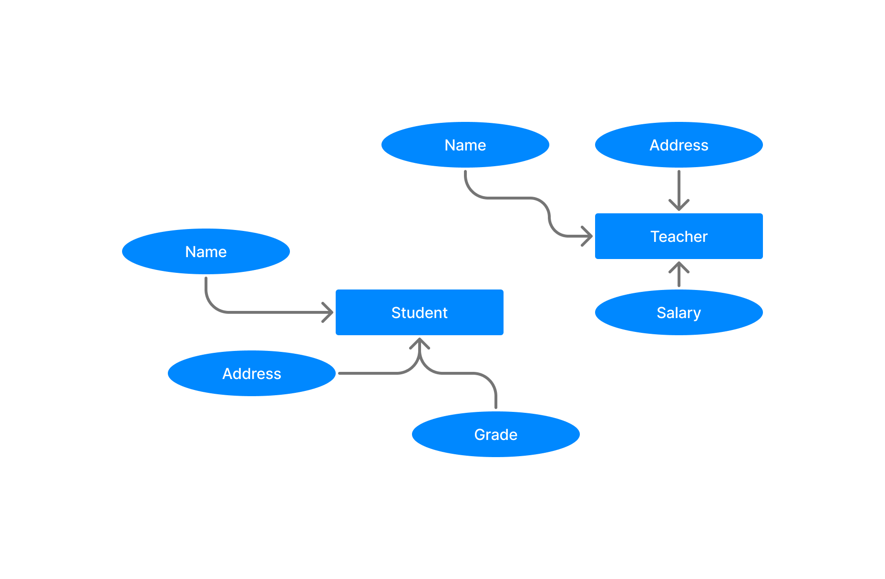
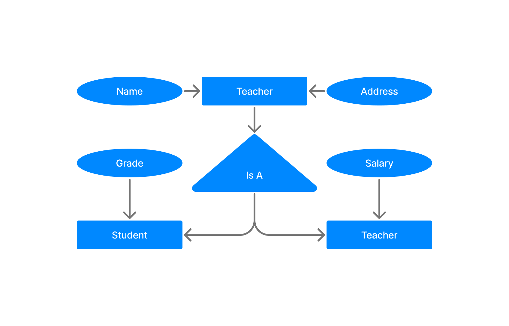

DBMS Generalization
===================

> 🟢 **Generalization** is a process in which the common attributes of more than one entities form a new entity. The newly formed entity is called **generalized entity.**

## Example

**Before generalization :**

**After generalization :**

### **Note :**

1. Generalization uses bottom-up approach where two or more lower level entities combine together to form a higher level new entity.
2. The new generalized entity can further combine together with lower level entity to create a further higher level generalized entity.

 

### [< ER Diagram to Table Conversion](./04.er_diagram_to_table_conversion.md)
### [Data Models](./data_models.md)
### [DBMS Specialization >](./06.dbms_specialization.md)

### [Go back README](./../README.md)
--------------------------------------------