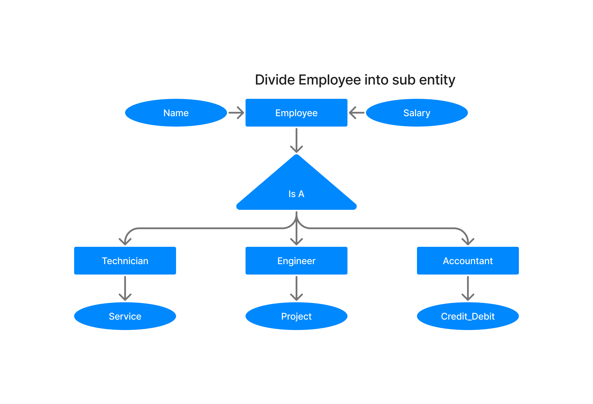

DBMS Specialization
===================

> 🟢 **Specialization** is a process, which divide a entity into sub-entities. It is a one kind of reverse process of generalization. It is a top-down process.

## Example of specialization :

 

### [< DBMS Generalization](./05.dbms_generalization.md)
### [Data Models](./data_models.md)
### [DBMS Aggregration >](./07.dbms_aggregration.md)

### [Go back README](./../README.md)
--------------------------------------------