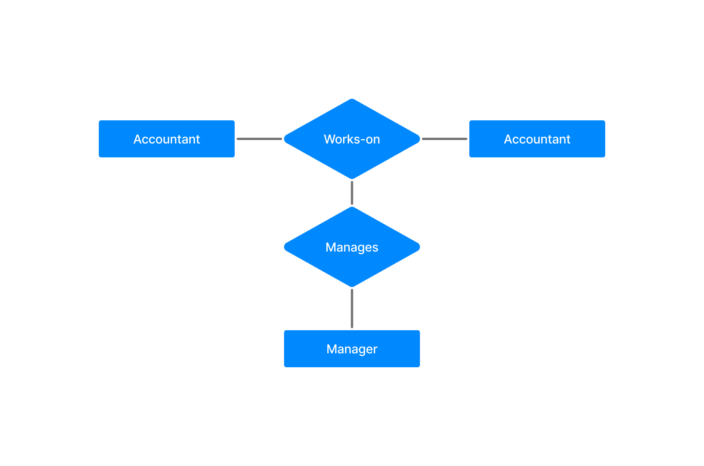

DBMS Aggregration
=================

> 🟢 Aggregation is a process to the relationship of two entities act as one entity.

### Example 

 

### [< DBMS Specialization](./06.dbms_specialization.md)
### [Data Models](./data_models.md)
### [Hierarchical Model in DBMS >](./08.hierarchical_model_in_dbms.md)

### [Go back README](./../README.md)
--------------------------------------------