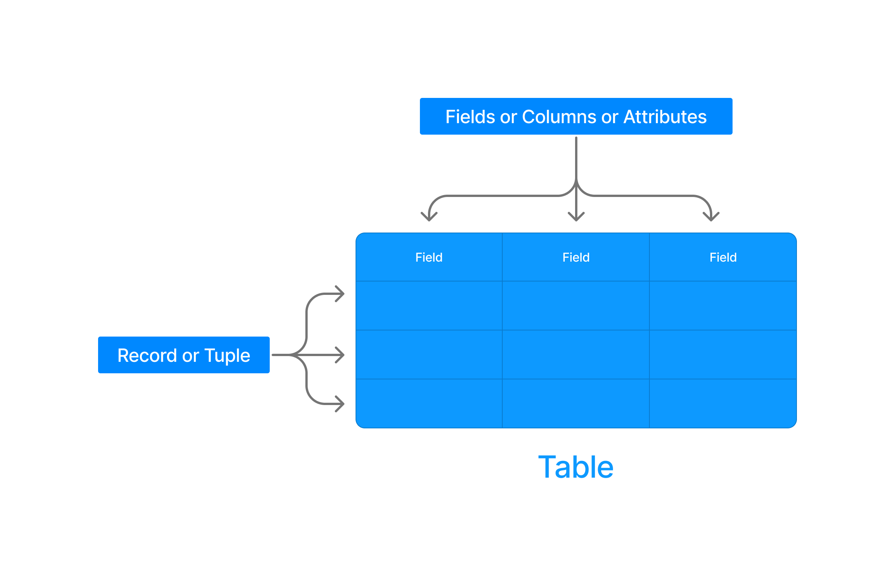

RDBMS Concepts
===============

A relational model can be represented as a table of rows and columns. The major components of relational database is : 

1. table
2. Record or Tuple
3. Field or Column name or Attribute
4. Domain
5. Instance
6. Schema
7. Keys

Here is some components in picture : 

## Domain

> 🟢 A domain is a set of permitted values for an attribute in table.

 

### [Relational Database](./relational_database.md)
### [Relational Algebra and Relational Calculus >](./02.relational_algebra_and_relational_calculus.md)

### [Go back README](./../README.md)
--------------------------------------------