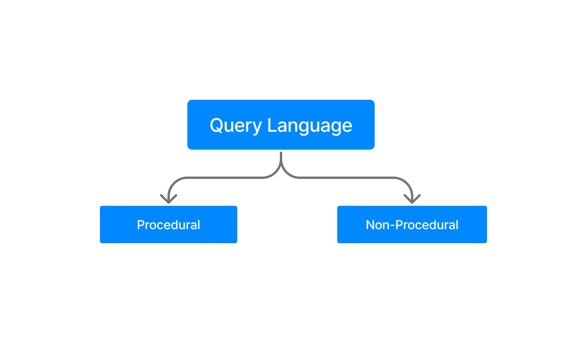
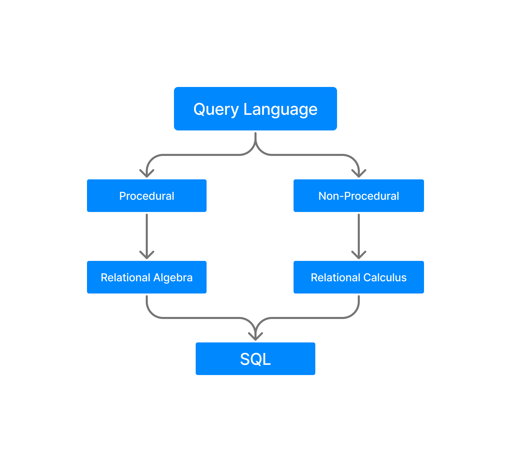

Introduction to Relational Algebra and Relational Calculus
===========================================================

## Query Language

> 🟢 A language which is used to store and retrieve data from database is known as query language. For example : sql.

**There are two types of query language :**
1. Procedural Query Language
2. Non-procedural Query Language

### Procedural Query Language

> 🟢 This type of language, user instructs the system to perform a series of operations to produce the desired results.

### Non-procedural

> 🟢 In Non-procedural query language, user instructs the system to produce the desired result without telling the step by step process.

## Relational Algebra

> 🟢 Relational algebra is a conceptual procedural query language used on relational model.

## Relational Calculus

> 🟢 Relational calculus is a conceptual non-procedural query langauge used on relational model.

 

### [<RDBMS Concept ](./01.rdbms_concept.md)
### [Relational Database](./relational_database.md)
### [DBMS Relational Algebra >](./03.dbms_relational_algebra.md)

### [Go back README](./../README.md)
--------------------------------------------