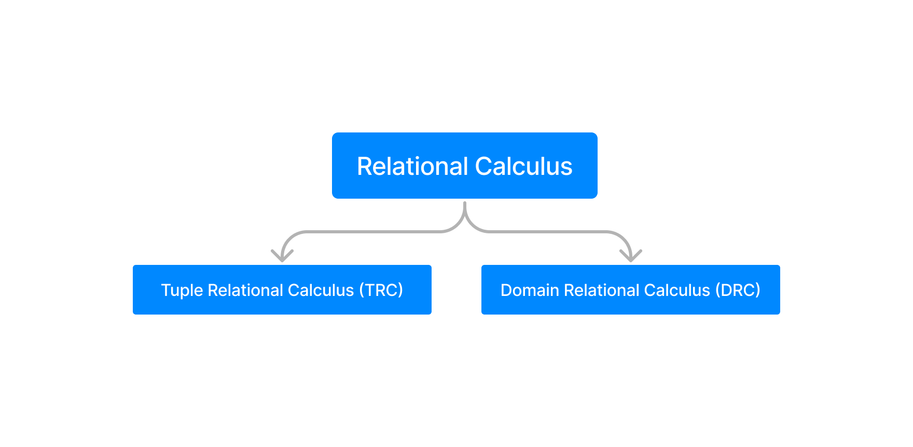

DBMS Relational Calculus
========================

The type of relation calculus :
1. [Tuple Relational Calculus (TRC)](#tuple-relational-calculus-trc)
2. [Domain Relational Calculus (DRC)](#domain-relational-calculus-drc)




<hr />


## Tuple Relational Calculus (TRC)

> 🟢 Tuple relational calculus is used for selecting those tuples that satisfy given condition.

**Here example :**

Table :
```cmd
First_Name     Last_Name     Age
----------     ---------     ----
Ajeet          Singh         30
Chaitanya      Singh         31
Rajeev         Bhatia        27
Carl           Pratap        28
```

Query to display the last name of those students where age is greater than 30 :

```sql
{ t.Last_Name | Student(t) AND t.age > 30 }
```

Here query divide by `|` symbo. The second part is condition.

The result will be :

```cmd
Last_Name
---------
Singh
```

<hr />

## Domain Relational Calculus (DRC)

> 🟢 In domain relational calculus the records are filtered based on the domains.

Here the example on above table, find the first anme and age of students where student age is greater than 27, 

```sql
{< First_Name, Age > | ∈ Student ∧ Age > 27}
```

**Note :** The symbols used for logical operators are: ∧ for AND, ∨ for OR and ┓ for NOT.

<hr />
<br />

### [< DBMS Relational Algebra](./03.dbms_relational_algebra.md)
### [Relational Database](./relational_database.md)
### [Keys in DBMS >](./05.keys_in_dbms.md)

### [Go back README](./../README.md)
--------------------------------------------